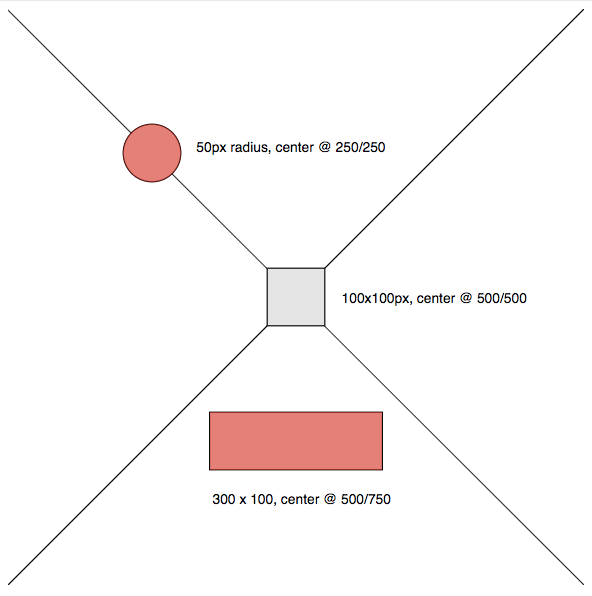

# image-marker

Sometimes you want clickable areas on images and think "yay, that's easy, we have this basically since forever". But
hold on. You don't actually SEE the clickable area, so you don't know where to click or that you're able to click at
all. The clickable area is also not responsive, and you can't control the position via CSS. Good luck with that.

`image-marker` gives you some primitives to overlay nodes over your image. You need 2 CSS classes (basic styles are
provided, extend at will), 1 line of Javascript and yeah okay lots of markup (see below).

## Usage

(For a full example see the [test page](index.html).)

~~~ jade
div.img-marker-container
  a.img-marker
  img
~~~

Provide positions to the marker via `data` attributes:

~~~ html
<a
  class="img-marker"
  href="#foo"
  data-img="selector#for.image"
  data-min-width="20"
  data-min-height="20"
  data-width="50"
  data-height="50"
  data-left="100"
  data-top="200" />
~~~

This will create a 50px square above 100/200 in the image. It will resize with the window, but never be smaller than 20px. Note that some special CSS is necessary for the positioning to work, but not much. Basic CSS is [available](dist/image-marker.min.css) and easy to extend to your needs.

Final step: Start the whole thing whenever you feel ready (probably on `DOMContentLoaded`).

~~~ javascript
const markerManager = new ImageMarker();
markerManager.registerMarkers();
~~~

# API

Functions available on an ImageMarker instance:

* `registerMarkers`: Looks for markers in the DOM and does a layout.
* `layout`: Goes through all markers and repositions them based on the current dimensions of their image.
* `destroy`: Removes markers and event listeners. Cannot be undone.

Aside from `destroy` all functions are safe to be called multiple times.

# TODO

* Possibly we can get rid of all the necessary IDs by looking at immediate children of the container?

# Fair Warning

I have a terrible track record of maintaining things, don't count on me.

# License

MIT
